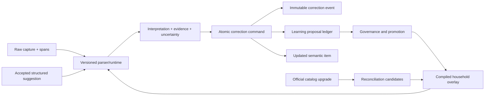

# Holistic Semantic Correction and Household Learning V2

**Status:** executable revised plan after post-plan code/design audit  
**Date:** 2026-08-13  
**Supersedes:** `docs/superpowers/plans/2026-08-13-holistic-semantic-learning-and-resolution-plan.md` for all not-yet-implemented work  
**Depends on:** the implemented safety and semantic foundations in Plans 001-005  
**Delivery rule:** strict TDD; one focused task and one local commit at a time; no online remote access

## Outcome

Duckworth will accept minimal natural-language input, preserve exactly what the person typed, produce an explainable structured interpretation, and learn safely from explicit corrections. A later household capture of the same semantic item will reuse only applicable corrections without overriding explicit current input. Unknown products remain addable. Product, language, unit, spelling, brand, descriptor, category, and shop knowledge stays in versioned data or governed household records—not product-specific TypeScript branches.

This phase is complete only when the following loop works across restart and a second family device:

1. A person enters an unknown or incorrectly interpreted item.
2. Duckworth saves the raw input and shows its interpretation.
3. The person corrects any combination of canonical name, commercial identity, descriptor, quantity, unit, pack, or shop eligibility in one save.
4. The server records an atomic before/after correction event and derives narrowly scoped learning.
5. The same applicable input is interpreted correctly next time.
6. Explicitly different input is never overwritten by the learned default.
7. The person can see why the result was learned, undo it, clear its future influence, or keep two identities separate.

## Audit findings that change the earlier plan

### P0 — The current overlay cannot learn an unknown household product

- `packages/shopping-intelligence/src/semantic-runtime.ts` limits `SemanticHouseholdLayer` to concept aliases, brand aliases, and quantity preferences.
- Household aliases must target an entity already present in the country runtime; compilation rejects an unknown target.
- Only the first household layer is compiled, so device and household overlays cannot be composed there.

**Correction:** add a household-local semantic entity registry with stable IDs, aliases, labels, provenance, status, and an explicit reconciliation path when a later official catalog release contains the same identity.

### P0 — Editing is not an atomic semantic correction

- `duckworth-api/src/app.ts` patches basic item fields and shop classification through separate endpoints.
- The general edit contract does not carry structured concept/product/brand roles, descriptors, correction scope, clause span, or idempotency.
- A name edit can clear semantic IDs before separately rebuilding only part of the graph.

**Correction:** introduce one idempotent correction command and immutable correction event. It validates and commits the item, classification, evidence, and learning proposal in one database transaction; SSE publishes only after commit.

### P0 — The learning vocabulary is too small and mixes facts with preferences

- Current kinds are alias, brand preference, variant preference, and quantity preference.
- Package values may be stored in JSON but are not compiled into future interpretation.
- A semantic identity fact, a spelling alias, a quantity default, and shop eligibility have different applicability and safety rules.

**Correction:** use typed learning effects with field-level precedence and applicability signatures. Never copy an entire prior item onto a new input.

### P1 — Brand correction and capitalization lack an honest unknown-entity path

The ontology can represent product families, brands, organizations, and commercial roles, but the correction UI/API does not let a person repair these roles. Guessing a brand from the first token or title-casing cannot correctly handle `iPhone`, `Nestlé`, numeric brands, regional scripts, or an unknown local brand.

**Correction:** canonical display labels come from reviewed runtime data or the exact casing confirmed by the household. Unknown entities receive household-local IDs. Brand owner, manufacturer, marketer, consumer brand/sub-brand, and product family stay distinct; absence of evidence stays unknown.

### P1 — Learning scope is under-specified

`Crocin 650 mg, 1 strip` must not teach every Crocin request to be 650 mg or one strip. A learned default must apply only when the current input omits that field and its identity/variant selector matches.

**Correction:** every learned effect has an `ApplicabilitySignature`: locale/country, concept/product/brand or household-local identity, identity descriptors, optional package signature, source phrase fingerprint, and field-presence predicates.

### P1 — Multi-item captures need clause-level provenance

One raw capture can create several items. Without source offsets, correcting one clause can accidentally support aliases or defaults from a neighbouring clause.

**Correction:** preserve `sourceStart`, `sourceEnd`, operation index, captured spans, and the raw clause on every correction event and learning evidence edge.

### P1 — The promotion policy is both too eager and too vague

An ordinary successful save or purchase is not proof that spelling and semantics were correct. Conversely, forcing a review screen after every exact correction creates needless work.

**Correction:** exact corrections to known entities or validated units activate quietly with a one-tap undo receipt; novel identities and scope-expanding rules require one explicit confirmation; inferred repeated evidence can only become a review candidate.

### P1 — Official catalog upgrades can collide with household knowledge

The earlier plan did not define what happens when `household-brand-123` later appears as an official regional product.

**Correction:** create a reconciliation candidate with link, merge, or keep-separate choices. Never silently rewrite historical capture/correction events.

### P1 — Schema migration and runtime performance need explicit designs

- SQLite `CHECK` changes require a table rebuild and verified data copy.
- The API currently reads learning entries and recompiles an overlay for capture requests.

**Correction:** version semantic snapshots and ledger records, provide upcasters and backup/dry-run/collision reports, and cache compiled household overlays by a monotonically increasing ledger revision.

### P1 — “Remove hardcoding” needs an enforceable boundary

For example, `duckworth-web/src/app/core/display-formatters.ts` contains English unit labels. Removing all constants is not the answer: safety invariants, structural enums, and mandatory application copy belong in code; dynamic domain/locale knowledge does not.

**Correction:** inventory and classify constants, move locale/domain labels and inflections to packs, and add an architecture check that rejects catalog IDs, product names, shop labels, and unit display rules in application source while allowing structural protocol constants.

### P2 — First-encounter intelligence must be honest

A local deterministic system cannot know every new product and its shop availability without reviewed data, prior household evidence, or user confirmation.

**Correction:** unknown text always remains addable; strong generic signals may produce provisional interpretations, otherwise the field stays unresolved with a one-tap correction. A provider-neutral enrichment seam may be designed, but no cloud/product provider is added in this phase.

## Final architecture



The system has four different data classes and must not collapse them:

1. **Observed input:** immutable raw capture, clause, spans, source, locale, runtime versions.
2. **Committed semantic item:** the current single source of truth for the list row.
3. **Correction evidence:** immutable before/after event explaining what the person changed.
4. **Future influence:** reversible, scoped learning effects derived from evidence.

## Contracts

### `SemanticCorrectionCommandV1`

Add a versioned contract under `packages/shopping-intelligence/src/contracts.ts` and expose it through OpenAPI:

```ts
interface SemanticCorrectionCommandV1 {
  schemaVersion: 1;
  idempotencyKey: string;
  itemId: string;
  expectedItemVersion: number;
  source: {
    captureInputId: string;
    operationIndex: number;
    sourceStart: number;
    sourceEnd: number;
    rawClause: string;
  };
  corrected: {
    canonicalLabel?: string;
    conceptRef?: SemanticEntityRef | null;
    productFamilyRef?: SemanticEntityRef | null;
    brandRoles?: CommercialRoleCorrection[];
    descriptors?: DescriptorCorrection[];
    quantity?: number | null;
    unitId?: string | null;
    packageSize?: number | null;
    packageUnitId?: string | null;
    packageContainerUnitId?: string | null;
    shopTypeDecisions?: ShopTypeDecision[];
  };
  learn: {
    mode: 'this_item_only' | 'future_matching_items';
    scope: 'household';
  };
}
```

`SemanticEntityRef` is either an existing runtime ID or a proposed household-local entity. The server validates all runtime IDs, unit dimensions, role types, descriptors, source offsets, and household/lane ownership. It derives household from the authenticated server session and rejects any command/item mismatch.

### Correction event

Persist the complete normalized `before` and `after` semantic snapshots, changed-field mask, source span, actor/device receipt, active runtime/catalog versions, idempotency key, and timestamp. Undo appends a compensating event; it does not delete history. Raw input is never mutated by a correction.

### Learning effect

Each proposal contains:

```ts
type LearningEffectKind =
  | 'canonical_label'
  | 'entity_alias'
  | 'commercial_role'
  | 'descriptor_value'
  | 'quantity_default'
  | 'unit_default'
  | 'package_default'
  | 'shop_eligibility';

interface ApplicabilitySignature {
  locale: string;
  countryCode: string;
  identityRefs: SemanticEntityRef[];
  identityDescriptorValueIds: string[];
  sourceAliasKey?: string;
  packageSignature?: string;
  applyOnlyWhenFieldAbsent: boolean;
}
```

Every effect also records supporting/contradicting evidence IDs, confidence calculation inputs, runtime policy version, state, expiry/review metadata, and the household overlay revision that first included it.

### Precedence

For every field independently:

1. explicit current text or explicit accepted structured suggestion;
2. server-validated current clarification/correction;
3. exact reviewed catalog/runtime evidence;
4. active household effect with matching applicability;
5. deterministic generic inference;
6. omitted-field application default, such as quantity `1`;
7. unresolved.

Learning can fill an omitted field but cannot replace an explicitly supplied current value. Conflicting active effects produce a clarification or remain unapplied; they never resolve by last-write-wins.

## Persistence model

Implement with repository methods, foreign keys, strict tables, and transactions in `duckworth-api/src/shopping-items.ts`:

- `semantic_correction_events`: immutable correction and undo/compensation events.
- `household_semantic_entities`: local concept/product-family/brand entities with canonical label, entity type, locale, status, provenance, and optional `replaced_by_catalog_id`.
- `household_semantic_aliases`: locale-scoped aliases to catalog or household-local entities with normalized key and evidence.
- `household_learning_proposals`: candidate/reviewed/active/suppressed/cleared/expired lifecycle.
- `household_learning_effects`: typed effect payload plus applicability signature.
- `household_learning_evidence`: proposal-to-correction support/contradiction edges.
- `household_overlay_revisions`: per-household monotonic revision for cache invalidation and replay.
- `catalog_reconciliation_candidates`: proposed local-to-official mapping with link/merge/keep-separate disposition.

Do not overload the existing preference row with more untyped JSON. Upcast compatible existing entries; quarantine invalid or ambiguous rows in the migration report rather than guessing.

## Promotion and retraction policy

| Evidence | Result | User friction |
|---|---|---|
| Explicit correction to a known catalog entity or validated unit alias | Active household effect | Save normally; show “Remembered for this household — Undo” |
| Explicit correction creating a novel entity or broadening shop eligibility | Reviewed proposal, then active after confirmation | One compact confirmation in the existing edit flow |
| Repeated captures without an explicit correction | Candidate only after the runtime policy threshold | Non-blocking learning inbox |
| Purchase | Weak supporting evidence only | None |
| Ordinary successful save | No spelling/semantic confirmation | None |
| Undo, explicit rejection, “keep separate,” or correction in the opposite direction | Contradict/retract and recompute | Explain changed future influence |

Thresholds, decay, and expiry live in versioned runtime policy data. Product-specific examples do not.

## Executable implementation sequence

Each task begins with the focused failing test, proves it red for the intended reason, makes the smallest coherent production change, proves it green, runs the stated regression set, and commits locally before the next task.

### Task 1 — Freeze an end-to-end correction/learning evaluation matrix

**Files**

- Add `packages/shopping-intelligence/src/semantic-correction.spec.ts`
- Add `duckworth-api/test/semantic-correction-learning.test.ts`
- Add `catalog/test/semantic-correction-fixtures.test.mjs`
- Add product-data-free fixtures under `catalog/test/fixtures/semantic-corrections/`

**Red cases**

- Unknown lowercase brand is corrected once and recurs with confirmed canonical casing.
- A known beverage with an omitted shop tag learns the corrected eligibility without a product-specific rule.
- `medicine 650 mg 1 strip` keeps `650 mg` as an identity/package descriptor and `1 strip` as requested quantity/unit.
- Explicit `2 strips` overrides a learned one-strip default.
- Same brand with a different strength/descriptor does not inherit the wrong package default.
- One item with two shop tags appears in both filtered views but total/active counts remain based on distinct item IDs.
- A correction in clause two of a batch does not teach clause one.
- Clear, restore, undo, restart, second-device reuse, and sandbox/live isolation.
- Unicode casing, numeric brand labels, IME composition, and unknown free-text fallback.

**Exit:** the evaluation corpus defines expected interpretation, evidence source, confidence/uncertainty, and whether learning should apply. No product named in a regression fixture is added to TypeScript production code.

### Task 2 — Add the atomic correction contract and command handler

**Files**

- Modify `packages/shopping-intelligence/src/contracts.ts`
- Modify `duckworth-api/src/app.ts`
- Modify `duckworth-api/src/openapi/`
- Modify `duckworth-api/test/shopping-items.test.ts`
- Regenerate `duckworth-web/openapi/duckworth-v1.json` and `duckworth-web/src/app/api/generated/schema.d.ts`

**Implementation**

- Add `POST /api/v2/households/:householdId/items/:itemId/semantic-corrections`.
- Derive household/lane from the authenticated session; retain the existing fail-closed pre-handler.
- Require idempotency and optimistic version checks.
- Validate source span membership in the original stored capture.
- Return the updated item, correction receipt, proposal receipts, and overlay revision.
- Keep legacy edit endpoints temporarily but make them delegate to the command where semantically possible; mark split semantic/classification mutations deprecated.

**Exit:** replaying the same idempotency key returns the original receipt; a conflicting payload or stale version is rejected; no event is published on rollback.

### Task 3 — Persist immutable correction events transactionally

**Files**

- Modify `duckworth-api/src/schema-ledger.ts`
- Modify `duckworth-api/src/shopping-items.ts`
- Add/modify `duckworth-api/test/shopping-items-migration.test.ts`
- Add `duckworth-api/test/semantic-correction-transaction.test.ts`

**Implementation**

- Add the correction, local-entity, proposal/effect/evidence, revision, and reconciliation tables.
- Make correction-event insertion, semantic item update, classification replacement, proposal derivation, and overlay revision increment one transaction.
- Add a compensating undo command with optimistic checks.
- Publish SSE after commit only.

**Exit:** injected failure at every transaction stage leaves item, classification, ledger, and revision unchanged. Restart preserves complete before/after provenance.

### Task 4 — Introduce household-local semantic identities

**Files**

- Modify `packages/shopping-intelligence/src/semantic-runtime.ts`
- Modify `packages/shopping-intelligence/src/entity-resolution.ts`
- Modify `packages/shopping-intelligence/src/identity.ts`
- Add `packages/shopping-intelligence/src/household-entities.spec.ts`
- Modify catalog schema/builder validation only for the generic entity/role contract

**Implementation**

- Support stable household-local concept, product-family, brand, and alias references in one compiled household aggregate layer.
- Preserve confirmed canonical label exactly; use Unicode-aware normalization only for lookup keys.
- Keep consumer brand/sub-brand, product family, organization, manufacturer, marketer, and brand owner as separate roles.
- Include product family/variant and all declared identity descriptors in the versioned semantic variant key.
- Represent required participants as known, confirmed absent, or unresolved; exact auto-merge requires all required participants resolved.

**Exit:** an unknown confirmed brand survives edit, merge, undo, restart, and next capture without title-casing or first-token inference.

### Task 5 — Model descriptors, packages, and units without item-specific grammar

**Files**

- Modify `packages/item-capture/src/index.ts`
- Modify `packages/shopping-intelligence/src/entity-resolution.ts`
- Modify `packages/shopping-intelligence/src/contracts.ts`
- Modify semantic catalog schemas and pack compiler
- Add focused parser/entity tests

**Implementation**

- Preserve every meaningful qualifier/container span as packaging qualifier, identity descriptor, preference, or unknown.
- Add a span-coverage invariant: every meaningful source span is assigned, warned, or drafted.
- Resolve generic units, containers, aliases, number placement, and plural forms through validated locale/runtime packs.
- A household may learn an alias to an existing validated unit but cannot invent an arbitrary measurement dimension or conversion.
- Package and quantity learning remains variant-scoped and omission-only.

**Exit:** adjective-like packaging text is not appended to the item name; identity-bearing descriptors remain; `1 strip` is recognized generically from its syntactic/unit role, not a medicine name.

### Task 6 — Compile a typed, field-level household overlay

**Files**

- Replace/extend `packages/shopping-intelligence/src/learning-overlay.ts`
- Modify `packages/shopping-intelligence/src/semantic-runtime.ts`
- Modify `duckworth-api/src/app.ts`
- Add `packages/shopping-intelligence/src/learning-overlay-v2.spec.ts`
- Add API cache/invalidation tests

**Implementation**

- Compile all active household effects into one immutable aggregate layer.
- Apply precedence independently for label, identity, descriptor, quantity, unit, package, and shop eligibility.
- Require an exact applicability match and explicit-field-absence before any default effect.
- Surface conflicts and ignored effects as evidence; never last-write-wins.
- Cache by `(householdId, overlayRevision, runtimeVersion)` and invalidate only after a committed revision increment.

**Performance budget:** define target catalog/ledger sizes in the fixture; record p50/p95 capture overhead and peak compiled overlay size. The release gate fails if the agreed local/mobile-class budget regresses.

### Task 7 — Add catalog reconciliation and reversible governance

**Files**

- Modify runtime registry/catalog activation code
- Modify `duckworth-api/src/shopping-items.ts` and `app.ts`
- Add catalog upgrade and collision tests

**Implementation**

- On catalog activation, compare household-local identity fingerprints with official entities.
- Create candidates only; never auto-merge.
- Support link, merge, and keep-separate dispositions.
- Preserve historical IDs/events and add `replacedByCatalogId` projection for future resolution.
- Recompute affected overlay effects and identity collision reports transactionally.

**Exit:** a catalog upgrade cannot silently merge two active list rows or make an old correction unreadable.

### Task 8 — Replace the edit UI with a minimal correction experience

**Files**

- Modify `duckworth-web/src/app/app.html`, `app.ts`, and `app.css`
- Add a semantic correction service/model under `duckworth-web/src/app/core/`
- Add Angular component/service tests

**Implementation**

- Keep item text as the only required entry; quantity defaults to one only when omitted.
- Show a compact interpretation diff: original clause, understood fields, corrected fields, and evidence/uncertainty.
- Let users correct name, brand/product role, relevant descriptors, quantity, unit, package, and multiple shop types in one save.
- Hide ontology complexity behind plain labels and progressive disclosure.
- Offer `This item only` and `Remember for matching items`; use one-tap undo.
- For novel or scope-expanding learning, show one compact confirmation. Known exact corrections save normally.
- Hints are contextual, dismissible/rate-limited, and locale-pack owned.
- Preserve IME composition and never rewrite text before suggestion acceptance.

**Exit:** mobile family users can repair every supported semantic field without being required to fill extra fields.

### Task 9 — Align typeahead with structured identity and trusted learning

**Files**

- Modify `packages/local-assistance/src/index.ts`
- Modify `duckworth-web/src/app/capture-assistance/`
- Modify brain adapter/server acceptance validation
- Add ranking, stale-token, poisoning, and performance tests

**Implementation**

- Use a versioned structured suggestion carrying canonical label, semantic IDs/roles, descriptors, confidence/evidence, runtime versions, and an opaque acceptance token.
- Globally rank match quality and trust; exact reviewed candidates normally beat fuzzy household history.
- Perform token-aware conservative matching and locale-driven transliteration/phonetics.
- Deduplicate by semantic identity plus display, not display alone; show ambiguity.
- Revalidate acceptance server-side. Preserve the rest of the quantity/package sentence.
- Do not treat successful capture, purchase, raw history, or SSE refresh as confirmed spelling evidence.
- Scope browser data by live/sandbox + household + device + locale, label it `This device`, and provide disable/view/clear/export controls.

**Exit:** spelling assistance is advisory, responsive, non-poisoning, and structurally consistent with committed semantics.

### Task 10 — Enforce the dynamic-knowledge boundary

**Files**

- Add `tools/architecture/check-domain-knowledge-boundary.mjs`
- Modify locale/semantic packs and display formatters
- Add architecture fixtures and package scripts

**Implementation**

- Inventory current application constants into: structural protocol/safety, mandatory application copy, locale presentation, or domain knowledge.
- Move unit labels/inflections, example strings, shop labels, and canonical entity display labels into validated packs.
- The static check analyzes imports/registries and known data-bearing constructs; do not use a brittle blacklist of ordinary words.
- Allow structural enum names, schema versions, validation errors, and safety defaults.
- Fail when application source embeds catalog IDs, item-specific parsing branches, category/shop labels, canonical products/brands, locale unit inflections, or production example products.

**Exit:** adding a new product, brand, shop type, descriptor value, locale label, or unit alias requires data changes and validation tests, not an application-code conditional.

### Task 11 — Migrate safely and expose local quality controls

**Files**

- Modify schema ledger/migration tests
- Add an offline migration/dry-run command under `duckworth-api/src/maintenance/`
- Add a compact household learning/control surface and local diagnostics export

**Implementation**

- Back up before table rebuild; validate row counts, foreign keys, hashes, and collision report.
- Upcast old semantic snapshots/results and compatible learning rows; quarantine ambiguous data.
- Keep family-live and sandbox databases, credentials, origins, browser namespaces, backups, and reports physically separate.
- Add a learning control center: what was learned, why, where it applies, undo/suppress/clear/restore, reconcile, export.
- Add local-only quality measures: correction rate, clarification/unresolved rate, learned-effect apply/override/conflict count, undo/rollback rate, and p95 capture/typeahead latency. Do not send telemetry externally.

**Exit:** backup, dry-run, migration, restart, rollback rehearsal, and restore are verified against a sanitized production-shaped copy before family-live activation.

### Task 12 — Integrated release gate and documentation

**Required commands**

From `duckworth-api`:

```powershell
pnpm language-packs:test
pnpm typecheck
pnpm test -- --run
pnpm build
pnpm openapi:write
```

From `duckworth-web`:

```powershell
pnpm assistance:test
pnpm intelligence:test
pnpm test -- --watch=false
pnpm typecheck
pnpm architecture:brain
pnpm architecture:shop-classification
node ../tools/architecture/check-domain-knowledge-boundary.mjs
pnpm build
```

Then run browser E2E only against the sandbox origin after the server proves the sandbox lane and expected instance ID. Perform a read-only smoke test on family-live from a second LAN device. Record exact commands, results, migration report, commit IDs, known limitations, rollback instructions, and manual observations.

**Exit:** all evaluation-matrix cases pass; no test writes family-live; counts remain unique across tag filters; correction learning works after restart and on a second device; explicit overrides win; unknown input remains addable; no product-specific production-code rule was added.

## Required acceptance scenarios

The release report must show actual before/after observations for these generic scenario classes (fixtures may use invented names):

- unknown brand capitalization corrected and reused;
- missing beverage/grocery eligibility corrected and reused;
- medicine-like item with strength and strip quantity parsed separately;
- package adjective versus identity adjective;
- one item eligible at multiple shops with no duplicate count;
- spelling suggestion selected without losing trailing quantity/package text;
- misspelling rejected so it does not poison household vocabulary;
- same identity with a different variant does not inherit the wrong default;
- catalog entity introduced after a household-local entity and reconciled safely;
- learning cleared/restored and correction undone;
- batch-clause isolation;
- live/sandbox and cross-household denial;
- restart, backup, restore, and offline operation.

## Features included in this correction phase

These are not optional polish; they close correctness or operability gaps:

- household-local semantic entity registry;
- atomic semantic correction command and immutable event;
- field-level scoped learning with explanation and one-tap undo;
- catalog reconciliation;
- structured correction UI with plain-language progressive disclosure;
- dynamic-knowledge architecture enforcement;
- compiled-overlay caching and performance budget;
- local quality/evaluation dashboard and export;
- correction clause/source provenance and replay.

## Explicitly deferred

- Photo/camera/gallery ingestion implementation. Preserve a shared `CaptureEnvelope` source adapter and provenance slot now so OCR/image capture can enter the same brain later.
- Cloud or retailer product-knowledge provider. Define only a provider-neutral, consent-gated enrichment boundary; local deterministic behavior remains authoritative.
- Member accounts/admin roles beyond the existing household/device session boundary.
- Prices, retailer routing, ordering, payments, medical advice, and automatic cloud publication.
- Arbitrary household-defined measurement dimensions or conversions.

## Stop conditions

Stop the release if any of these occurs:

- a correction overrides explicit current input;
- historical raw input or correction evidence is rewritten or lost;
- a migration has unresolved identity collisions or cannot restore its backup;
- a mutating test can reach family-live;
- an unknown product becomes a confident classification without evidence;
- a catalog upgrade silently merges local identity;
- a multi-tag view changes distinct total item count;
- a product/language-specific conditional is added to application code;
- a correction transaction can partially update item, tags, learning, or overlay revision.

## Definition of done

This plan is done only after Tasks 1-12 are individually committed and the final integrated gate passes. Passing unit tests alone is insufficient: the release evidence must include migration/rollback rehearsal, sandbox browser E2E, second-device family-live read-only smoke testing, overlay performance measurements, and an explicit limitation statement for first-time unknown products.
