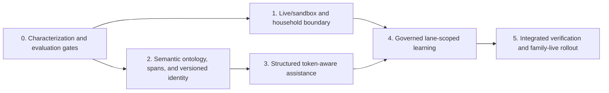

# Duckworth Intelligent Capture and Family-Live Hardening

**Status:** Plans 001-005 are the implemented baseline; post-plan audit revision 006 is proposed  
**Date:** 2026-08-13  
**Scope:** spelling assistance, commercial identity, descriptor intelligence, governed learning, and physically isolated family-live/sandbox operation

## Executive decision

Do not implement the earlier ideas as independent UI features. Implement one governed capture pipeline and one fail-closed deployment/data plane:

1. Raw input, source spans, and optional accepted suggestion evidence enter the brain.
2. The brain resolves concepts, commercial entities, descriptors, quantities, packages, and shop tags from versioned runtime data.
3. Uncertainty is preserved as evidence, warnings, or a clarification draft; text is never silently discarded or rewritten.
4. The server revalidates client suggestions and owns committed identity.
5. Learning is an evidence-backed, reversible proposal ledger, not an automatically growing dictionary.
6. Family-live and sandbox run as different processes with different physical databases, credentials, origins, and mutation permissions.

This is the smallest architecture that covers the stated use cases without hardcoded product/language rules in TypeScript. “Foolproof” cannot be guaranteed, but the implementation can be fail-closed, observable, reversible, and release-gated.

## Verified holes in the earlier plan

| Priority | Hole | Verified consequence | Resolution plan |
|---|---|---|---|
| P0 | A URL/`localStorage` household ID is trusted by many API routes | Any LAN client can address family data or capture provenance | [001](./001-live-sandbox-and-household-boundary.md) |
| P0 | Port 4200 is hardcoded in mutating E2E scripts | Making 4200 family-live would contaminate real data | [001](./001-live-sandbox-and-household-boundary.md) |
| P0 | Both frontend modes currently proxy to API 3000 | A sandbox badge could still write to live | [001](./001-live-sandbox-and-household-boundary.md) |
| P0 | Successful captures immediately become spelling evidence | A typo can outrank reviewed vocabulary and spread through the household | [004](./004-governed-learning.md) |
| P0 | Semantic merges/corrections drop `productId` | Product-specific identity and shop tags disappear after an edit/merge | [002](./002-commercial-identity-and-descriptors.md) |
| P1 | Brand model has only one `brandId` | Maggi/Nestle roles cannot be represented truthfully | [002](./002-commercial-identity-and-descriptors.md) |
| P1 | Adjectives are not assigned semantic roles | `low-fat milk` can be lost or `big pack` can become a false variant | [002](./002-commercial-identity-and-descriptors.md) |
| P1 | Pack qualifier/container spans are discarded | The brain cannot explain or replay “big pack of 8” | [002](./002-commercial-identity-and-descriptors.md) |
| P1 | Suggestion acceptance replaces the entire input | Accepting a product suggestion can erase quantity/package text | [003](./003-structured-capture-assistance.md) |
| P1 | Ranking uses source buckets before global match quality | A fuzzy learned typo can beat an exact reviewed product | [003](./003-structured-capture-assistance.md) |
| P1 | Fuzzy matching compares whole strings | `maggie noo` can miss `Maggi noodles` without hardcoded aliases | [003](./003-structured-capture-assistance.md) |
| P1 | “Accepted” household suggestions do not affect future behavior | The learning loop is currently a dead end | [004](./004-governed-learning.md) |
| P2 | `local-device` is treated as a personal profile | Shared-browser corrections are not actually personal | [004](./004-governed-learning.md) |
| P2 | Flat-array search performs full edit distance per candidate | Larger catalogs will cause mobile typing latency | [003](./003-structured-capture-assistance.md) |

## Dependency order

The focused `productId` merge/correction defect in Plan 002 may land immediately after its red regression test. All other semantic migrations wait for characterization, catalog validation, snapshot upcasters, and collision reports.

## Cross-cutting invariants

- Unknown free text always remains addable.
- No silent spelling correction, quantity invention, descriptor deletion, or semantic merge.
- Every meaningful source span is represented by a structured field/evidence, warning, or draft.
- Catalog IDs are stable; display capitalization comes from locale data, never title-casing heuristics.
- Product/language/category knowledge lives in validated data packs, not application conditionals.
- A client candidate is a hint. The server validates it against the active runtime before commit.
- Learning never overrides explicit current input and is reversible through evidence-linked events.
- Live and sandbox never share a database, credential, process, origin, browser-learning namespace, reset command, or backup target.
- A test runner aborts before mutation unless the server proves `lane=sandbox` and the expected instance ID.
- The family URL is live by default only after the isolation release gate passes.

## Delivery units

- [Plan 001 — Live/sandbox and household boundary](./001-live-sandbox-and-household-boundary.md)
- [Plan 002 — Commercial identity and descriptor semantics](./002-commercial-identity-and-descriptors.md)
- [Plan 003 — Structured capture assistance](./003-structured-capture-assistance.md)
- [Plan 004 — Governed household learning](./004-governed-learning.md)
- [Plan 005 — Integrated verification and rollout](./005-verification-and-rollout.md)
- [Plan 006 — Holistic semantic correction and household learning V2](./006-holistic-semantic-correction-and-learning-v2.md)

## Post-plan revision

Plan 006 is the authoritative executable plan for the correction and self-learning phase discussed after Plans 001-005. It supersedes the unimplemented portions of `docs/superpowers/plans/2026-08-13-holistic-semantic-learning-and-resolution-plan.md`.

The revision adds design elements the earlier plan did not fully cover: household-local semantic identities, a transactional idempotent correction command, clause-level provenance, field-specific applicability and precedence, catalog reconciliation, SQLite rebuild/upcast/rollback mechanics, overlay caching, static enforcement of the dynamic-knowledge boundary, and local quality diagnostics. It also states the honest limit of first-encounter offline intelligence and keeps photo ingestion as a future adapter over the same capture contract.

Each task uses strict red-green-refactor. No later task begins until the current task's focused tests pass and its migration/rollback implication is recorded.
