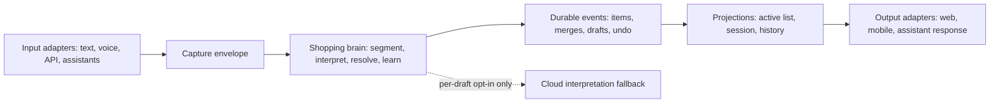

# Local-First Conversational Shopping Brain Design

**Status:** Architecture approved; awaiting review of this written specification.

**Date:** 2026-08-10

## Goal

Extend Duckworth from single-item capture into a fast, source-agnostic conversational shopping system. Users can add one item at a time, dictate many items in one utterance, or add details later. Clear information is interpreted locally and persisted immediately; only unresolved fragments need clarification.

The shopping domain includes groceries, electronics, pharmacy items, apparel, and general household goods. Grocery-style package data is useful when relevant, but it is never mandatory for every category.

The system has three explicit layers:

1. **Input adapters** accept text, voice transcripts, API commands, and future assistant integrations.
2. **The shopping brain** interprets, resolves context, learns from confirmed household behavior, and commits durable changes.
3. **Output adapters** render or speak the same result through web, mobile, tablet, API, and assistant surfaces.

No input source contains shopping policy. No output surface reinterprets user language.

## Scope and non-goals

Phase 1 supports one active conversation session per household. An active shopping list may remain open for days; closing a conversation does not archive, purchase, remove, or hide its items.

This remains shopping-list capture and management only. It does not add retailer routing, carts, pricing, payments, automatic ordering, currency conversion, remote product lookup, pharmacy advice, dosage guidance, or prescription handling.

### Implemented Phase 1 boundary

Phase 1 now provides:

- a source-neutral local capture contract for text, voice transcripts, API callers, and future assistant adapters, with the web text adapter and HTTP API as the shipped input/output surfaces;
- deterministic multi-clause interpretation, category-sensitive fields, exact-variant merging, clarification drafts, and per-adjustment Undo in the shopping brain rather than in Angular;
- one durable active conversation context per household, explicit close, draft review/resolve/dismiss, and local API contracts for household settings and advisory learned suggestions;
- an active shopping list that survives conversation closure, plus explicit immutable archive snapshots that can be reviewed, reopened, or copied without marking items purchased or ordered; and
- local SQLite persistence and migrations that work for fresh and existing databases.

Phase 1 does not ship microphone capture, Alexa/Google assistant SDK integrations, concurrent speaker/device routing, an end-user settings/learning screen, an automatic idle-close scheduler, a cloud draft interpreter, retailer/ordering/payment flows, price safety, or medical advice. The stored idle-close and cloud-assist preferences are contracts for later adapters; no timer or cloud call is activated in this phase.

Any Phase 2 plan or release must first pass the [Mandatory Phase 2 release gate for concurrent speaker and device contexts](#mandatory-phase-2-release-gate-concurrent-speaker-and-device-contexts).

## Core terms

| Term | Meaning |
| --- | --- |
| Capture | One raw input from any source. |
| Conversation session | Durable context for recent language, follow-up references, and unresolved drafts. |
| Shopping list | The active, user-visible collection of needed items; independent of a session. |
| Draft | A persisted unresolved fragment with its reason and candidate references. |
| Shopping event | An immutable accepted create, merge, correction, removal, restoration, or undo. |
| Projection | A current list, session, activity history, or channel-specific confirmation derived from events. |

## Architecture



The existing `@duckworth/shopping-intelligence` package remains the public domain boundary. Low-level deterministic capture and local assistance remain dependency-free collaborators. Transport, voice recognition, UI, database access, and future assistant SDKs stay outside the brain.

### Capture envelope

Every input adapter creates the same command. `source` is diagnostic metadata only and cannot alter the shopping decision.

```ts
interface ConversationCaptureCommand {
  householdId: string;
  sessionId?: string;
  text: string;
  locale: string;
  countryCode: string;
  source: 'text' | 'voice' | 'api' | 'assistant';
  occurredAt: string;
}
```

## Brain responsibilities

### Local segmentation and interpretation

The brain first attempts deterministic local interpretation. It splits a long capture into candidate clauses while preserving source spans. Every clause becomes exactly one of:

- a high-confidence item interpretation;
- an update candidate linked to exactly one active item;
- an ambiguous draft;
- a validation error.

Clear clauses are committed even if another clause is ambiguous.

### Structured item model

```ts
type ItemCategoryId = 'grocery' | 'electronics' | 'apparel' | 'pharmacy' | 'general';

interface ItemIntent {
  itemName: string;
  category: { id: ItemCategoryId | 'unknown'; confidence: 'confirmed' | 'inferred' | 'unknown' };
  brand: { id?: string; label: string; confidence: 'confirmed' | 'unverified' } | null;
  requestedCount: number | null;
  requestedUnit: CanonicalContainerUnit | null;
  packageSize: number | null;
  packageUnit: CanonicalMeasureUnit | null;
  attributes: Readonly<Record<string, string | number>>;
  captureText: string;
  identityKey: string;
}
```

Requested count/unit and package size/unit remain separate and optional. `pack`, `pouch`, `bottle`, `piece`, and `box` are not interchangeable. Recognized aliases such as `nos`, `pcs`, `pack`, `pac`, and `pacs` are canonicalized for reasoning while the original wording is retained for traceability.

### Category profiles and relevant fields

The brain uses a local category profile only after interpreting the item phrase. A profile identifies useful fields and presentation rules; it never rejects an item or fabricates missing details. Unknown categories remain valid generic shopping items.

| Category | Common relevant details | Examples |
| --- | --- | --- |
| Grocery | brand, requested container count, package size and measure | `Milk · 4 pouches · 1 litre each` |
| Electronics | brand, model/variant, requested item count | `Apple iPhone · 1 piece` |
| Apparel | brand, variant attributes such as size or colour, requested item count | `Cotton T-shirt · size L · 2 pieces` |
| Pharmacy | brand/product, requested count or pack information when spoken | `Crocin tablets · 1 strip` |
| General/unknown | any clear requested count and the original item wording | `Replacement door hook · 2 pieces` |

Category-specific attributes such as an apparel size, colour, electronics model, or pharmacy form are retained only when clearly spoken. They are stored in `attributes` and rendered only by an output profile that understands them. A phone, tablet, or garment therefore has no empty package-size fields, and a grocery item has no invented apparel/electronics attributes.

The classifier uses reviewed local product data, household-confirmed learning, and deterministic wording signals. If classification is uncertain, it assigns `unknown`, retains the raw item wording, and requests clarification only when the uncertainty blocks a required action such as a follow-up update or a merge.

### Cautious unit canonicalization

Canonical/SI-compatible values support comparison, validation, search, and derived reasoning only. The request remains in its meaningful scale:

```text
Milk · 4 pouches · 1 litre each
```

It must never be rewritten as `4,000 ml` merely because that total is calculable. Derived totals are explanatory data, never replacements for the requested pack representation.

### Follow-ups and ambiguity

“Make the Amul butter two packs” updates an active item only if exactly one semantic match exists. If several items could match, the brain creates a draft with candidates rather than guessing. A changed brand, variant, package size, or package unit creates a new item unless the user explicitly requests replacement or correction.

### Events, merges, and undo

Every high-confidence clause is committed before the next clause is processed. Merges are additive rather than destructive: a later two-pouch milk addition is a distinct adjustment event. Undo emits a compensating event for that adjustment only, both immediately and from item activity history.

The database stores events, raw captures, recognized spans, drafts, and fast current projections atomically.

### Local household learning

Only confirmed household events teach the brain. It may learn brands, usual package sizes, units, quantities, and repeat patterns. It surfaces these as visible suggestions, for example:

```text
Usually: 4 pouches · 1 litre each
```

Explicit new input always wins. Learning cannot create an item, alter a quantity, or replace a brand without user acceptance. Users can review or clear household learning.

### Cloud fallback by consent

Local interpretation is the normal path. If a draft remains unresolved and cloud interpretation is available, the output adapter offers a per-draft action explaining that the fragment will be sent for interpretation.

A household setting controls whether this action is available. It is off when the user disables it, and cloud escalation is never automatic. Cloud output returns candidates to the local brain; the local brain still applies duplicate, correction, lifecycle, and persistence policy.

## Session and list lifecycle

### Conversation sessions

- One active session per household in Phase 1.
- A session opens or resumes automatically with input.
- Default closure is explicit user action: **Close conversation**.
- A household may opt into automatic idle closure through settings, including **Off**.
- Closing a session only ends contextual reference resolution. It preserves its history and drafts for review or reopening.
- Unresolved drafts remain visible in **Needs clarification** and are never silently buried in session history.

### Shopping lists

- The active list survives session closure and can remain active for days.
- **Archive this list** is separate and explicit, creating a reviewable historical snapshot.
- Archiving does not mean purchased or ordered.
- An archived list can be reopened or copied into a new active list.
- Purchase and removal remain independent lifecycle actions.

## Output contract

The brain returns a channel-neutral result:

```ts
interface ConversationCaptureResult {
  saved: ItemChange[];
  merged: ItemChange[];
  drafts: ClarificationDraft[];
  suggestions: LearnedSuggestion[];
  undo: UndoToken[];
}
```

- A simple input receives a concise non-blocking confirmation.
- A multi-item capture receives a compact saved/merged/needs-clarification summary.
- A future voice surface must give a short spoken confirmation and mention only unresolved parts.
- The shipped web surface offers immediate Undo; durable events preserve the data required for a future item-activity view and mobile adapter.

## Error handling, performance, and offline behavior

- Clear items are saved even when another clause is ambiguous.
- Ambiguous references create durable drafts with candidate items; no guessing occurs.
- Failed or unavailable cloud escalation leaves the local draft intact.
- A stale correction or undo returns current state and preserves the user's draft.
- Common single-item, multi-item, brand, quantity, package, merge, and follow-up cases run locally with no network request.
- The cloud path is exceptional, explicitly consented, asynchronous, and cannot block local capture or draft creation.

## Mandatory Phase 2 release gate: concurrent speaker and device contexts

Before any Phase 2 implementation plan is approved, this design must be revisited for simultaneous speakers and devices. Phase 2 must replace the single-household-session assumption with isolated context ownership, such as per-device, per-speaker, or explicitly selected sessions.

The Phase 2 plan must address context identity and routing, concurrent reference resolution, simultaneous-edit conflicts, speaker/device privacy boundaries, session handoff and closure UX, and tests proving one context cannot resolve or alter another context's draft accidentally.

This is a release gate, not a backlog suggestion.

## Acceptance criteria

- Text, voice transcript, API, and future assistant adapters produce the same decision for the same capture.
- A long capture saves all high-confidence clauses immediately and preserves only unresolved clauses as drafts.
- A follow-up updates an item only when exactly one active semantic match exists.
- Brand, container count, package size, and package measure remain distinct fields.
- Category profiles make fields relevant rather than mandatory: an iPhone, tablet, apparel item, pharmacy item, and unknown item remain valid without grocery package data.
- Category-specific attributes are stored only when clearly spoken and are not invented from an uncertain category classification.
- Display preserves meaningful pack units and never substitutes an aggregated base-unit total for the request.
- A merge is individually undoable immediately; its durable event history supports a future activity view.
- Household learning is local, confirmed-event-based, advisory, and reversible through its Phase 1 API contracts; an end-user settings/learning screen is future work.
- Any future cloud interpretation remains opt-in per draft and can be disabled in household settings; Phase 1 performs no cloud call.
- Conversation closure never changes shopping-list lifecycle state.
- List archival is explicit, reviewable, reopenable, and distinct from purchase/order.
- The [Mandatory Phase 2 release gate](#mandatory-phase-2-release-gate-concurrent-speaker-and-device-contexts) is raised before any multi-device/speaker implementation work begins.
- The approved Phase 2 implementation boundary is recorded in the [concurrent-context design](2026-08-11-concurrent-contexts-design.md) and verified by its [acceptance gate](2026-08-11-concurrent-contexts-acceptance.md).
