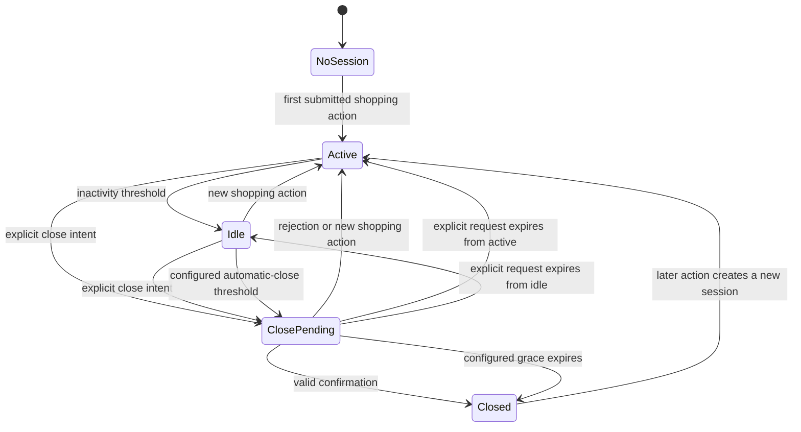

# Automatic Conversation Lifecycle and List Scope Design

**Status:** Approved design; awaiting review of this written specification.

**Date:** 2026-08-11

## Purpose

Make Duckworth manage device context and conversation lifecycle automatically without exposing technical controls on the main shopping screen. The result must remain safe when the application moves from one visible household list to multiple lists and from one speaker to simultaneous devices and speakers.

This specification extends the approved local-first conversational shopping brain and concurrent-context designs. Where an older contract assumes one household-wide session or a manually closed context, this specification supersedes that assumption.

## Product invariants

1. Opening the application does not open a shopping conversation. The first submitted shopping-domain action opens or resumes one.
2. Silence, inactivity, page blur, refresh, browser exit, network loss, and application restart never close a conversation unless the household explicitly enabled an automatic idle-close policy.
3. Default closure requires an explicit close intent followed by confirmation.
4. Closing a conversation never removes, purchases, archives, hides, or otherwise changes shopping-list items.
5. Context revocation, conversation closure, list archival, item removal, and item purchase are separate lifecycle operations.
6. Every modern command is scoped to a household, shopping list, authorized context, and idempotency key before a session is selected.
7. Angular and other output adapters render brain decisions; they do not interpret close intent, resolve references, detect duplicates, or select sessions.
8. Item, brand, unit, locale, country, device, speaker, and household records come from configuration, stored data, or input. Product data is not embedded as application policy.
9. Existing clear shopping information is persisted immediately. Ambiguous remainder is preserved as a durable clarification draft.
10. A logically long-lived session holds no open database transaction, lock, HTTP request, or unbounded in-memory prompt.

## Architectural boundary

```mermaid
flowchart LR
  A["Input adapters: text, voice, API, assistants"] --> B["Normalized capture envelope"]
  B --> C["Context and list resolver"]
  C --> D["Source-neutral shopping brain"]
  D --> E["Lifecycle and shopping decisions"]
  E --> F["Atomic repository and event log"]
  F --> G["Projections: list, session, drafts, pending actions"]
  G --> H["Output adapters: web, mobile, voice"]
```



Input adapters provide transport metadata and authenticated identity. They cannot alter interpretation policy. The brain returns pure decisions. Repository code authorizes scope, serializes concurrent writes, persists events, and builds projections. Output adapters display the authoritative projections.

## Ownership hierarchy

```text
Household
  ConversationContext
  ShoppingList
    ShoppingItem
  ConversationSession (links one context and one list)
    ClarificationDraft
    PendingConversationAction
    ShoppingEvent
```

All relevant commands and records carry:

```ts
interface ConversationScope {
  householdId: string;
  shoppingListId: string;
  contextId: string;
  sessionId?: string;
  actorId?: string;
  idempotencyKey: string;
  source: 'text' | 'voice' | 'api' | 'assistant';
  locale: string;
  countryCode: string;
  occurredAt: string;
}
```

`actorId` is optional until the multi-speaker adapter supplies a verified speaker. Locale and country come from the validated adapter or household settings, not a fixed backend value.

## Separate lifecycle models

### Device conversation context

States: `active`, `revoked`.

- Context registration and restoration happen automatically after household authentication.
- An expired or rotated token may be refreshed or reauthenticated.
- A context deliberately revoked from Settings cannot silently register itself again.
- Revocation atomically prevents new access and closes every active, idle, or pending session owned by that context with reason `context_revoked`.
- Revocation never changes the shopping list.

The current end-user actions “Use this browser context” and “Close context” are removed from the main screen. Device removal remains an explicit, confirmed Settings action.

### Conversation session

States: `active`, `idle`, `close_pending`, `closed`.



`idle` is a durable status, not a running process. A new input resumes the same session. Input received after `closed` creates a new session on the same list; it does not silently reopen the old session.

### Shopping list

States: `active`, `archived`.

- Phase 2 initially exposes one active default list per household.
- Every record receives a real `shoppingListId` now so multiple lists can be enabled without changing conversation ownership.
- List archive remains explicit and confirmed.
- Archived lists remain reviewable, reopenable, and copyable.
- Session closure cannot archive a list.

### Shopping item

States remain `active`, `purchased`, and `removed`. Removal is reversible through a compensating event and activity history. None of these states is implied by session or list closure.

## Automatic context and session resolution

### Application initialization

1. Restore the authenticated household.
2. Restore the stable local device identifier.
3. Authorize the stored context token or perform the permitted registration/refresh flow.
4. Resolve the explicitly selected list or the household's single/default list.
5. Hydrate list, current context session, unresolved drafts, and pending actions.
6. Render the application without opening a new session.

If context authorization temporarily fails, the application keeps unsent input available for retry. It must not submit through an arbitrary household-wide legacy context.

### First submitted shopping action

1. Resolve and authorize household, list, and context.
2. Find the active or idle session for exactly `(householdId, shoppingListId, contextId)`.
3. Create a session if none exists.
4. Send the capture to the shopping brain.
5. Commit accepted item changes, drafts, events, and the idempotency receipt atomically.
6. Return a channel-neutral result and refreshed projection.

Loading the page, focusing the field, typing, or requesting typeahead suggestions does not create a session.

### Future multiple-list resolution

- An explicit list name or identifier wins.
- An explicitly selected current list is used when the capture contains no contrary list reference.
- The single active/default list is used when it is the only candidate.
- If two or more lists remain plausible, the brain creates a list-selection clarification rather than guessing.
- Follow-ups, drafts, duplicate matching, pending actions, and closure remain within the selected list.

## Close-intent interpretation

The shopping brain classifies the semantic action and its scope. A phrase is not a close request merely because it contains words such as “done,” “finish,” “enough,” or “close.”

Positive candidates include:

- “I am done adding items.”
- “Finish this shopping session.”
- “Close this conversation.”
- “That is everything for this list.”

The following must not close the session:

- “I am not done.”
- “Do not close the list.”
- “That is enough milk.”
- “I am close to finishing.”
- “Finish adding the butter details.”
- “I will think of more things later.”
- “Done detergent.”

The decision engine evaluates negation, target scope, competing shopping actions, and confidence. A confident session-level request creates a `PendingConversationAction`; it never closes the session directly.

## Close confirmation protocol

```ts
interface PendingConversationAction {
  id: string;
  householdId: string;
  shoppingListId: string;
  contextId: string;
  sessionId: string;
  type: 'close_session';
  origin: 'explicit_intent' | 'configured_idle_policy';
  previousSessionStatus: 'active' | 'idle';
  status: 'pending' | 'confirmed' | 'cancelled' | 'expired';
  expiresAt: string;
  createdAt: string;
  resolvedAt: string | null;
}
```

A confirmation succeeds only when it matches the same household, list, context, session, pending-action ID, and unexpired state. The confirming command also carries an idempotency key.

- “Yes” without an active pending action does nothing destructive.
- A confirmation from another context is forbidden.
- Replayed confirmation returns the original result.
- Rejection cancels the pending action and restores `previousSessionStatus` unless the rejection is a new shopping command, which activates the session.
- A new shopping command cancels the pending action and is processed normally.
- Expiry of an explicit request cancels the pending action and restores `previousSessionStatus`. It cannot later be confirmed.
- Expiry of the grace period for a configured automatic-close action closes the session using the household's stored opt-in authorization.

The web surface may display a temporary confirmation prompt with “Close session” and “Keep adding.” Text and voice adapters may confirm conversationally. This temporary safety prompt does not reintroduce a permanent technical session button.

## Optional automatic idle closure

Default household policy:

```text
automatic closure: off
explicit confirmation: required
keep list visible after closure: always
new input after closure: create new session
```

When a household explicitly enables automatic closure, it configures a threshold and grace period. The stored opt-in is standing authorization for the automatic transition.

1. Normal inactivity changes `active` to `idle`.
2. Reaching the configured threshold creates `close_pending` with origin `configured_idle_policy`.
3. The application warns the user when a notification surface is available.
4. New input during the grace period cancels closure.
5. At grace expiry, the repository closes the session idempotently.
6. The list remains visible and unchanged.

Automatic closure is reversible in the sense that all history remains and later input creates a fresh session on the same list. It never deletes data.

## Concurrency rules

### Capture versus close

Both operations are serialized transactionally.

- If capture commits first, its item changes persist and the session may then close.
- If close commits first, the capture creates a new session and still persists the item.
- No valid capture is discarded because closure raced with it.

### Context isolation

- A context token cannot authorize another context, household, list, session, draft, or pending action.
- Two contexts may contribute to the same deliberately shared list while retaining separate session references and drafts.
- Closing context A's session cannot close context B's session.
- Handoff is explicit, target-bound, short-lived, and single-use.

### Item conflicts and replay

- Replayed `(contextId, idempotencyKey)` returns the original result.
- Exact duplicate merges remain additive and individually undoable.
- Stale corrections return current state rather than overwriting a newer version.
- List identity is included in duplicate and event queries.

## Durable projections and UI behavior

The web application hydrates authoritative state on load and refresh. The last in-memory capture response is not the source of truth.

The main screen removes:

- “Use this browser context”;
- “Close context”;
- the permanent “Close conversation” button;
- raw context labels, device IDs, tokens, and session IDs.

The main screen retains:

- the active shopping list;
- typeahead assistance;
- saved/updated/needs-clarification summaries;
- reversible item removal and event-specific Undo;
- draft review;
- temporary close confirmation when applicable;
- concise status after closure, while keeping the list visible.

Device revocation is placed in Settings. List archive remains in the list menu because it changes a user-visible list lifecycle.

## Settings design

### Conversation behavior

- Closure mode: explicit confirmation or configured idle closure.
- Idle threshold: available only when automatic closure is enabled.
- Grace period and warning behavior.
- New-input behavior after closure, fixed initially to “start new session.”

### Suggestions and learning

- Enable or disable suggestions.
- Review learned brands, units, package sizes, and usual quantities.
- Clear household learning.

Only confirmed events teach the brain. Learning remains advisory and reversible.

### Devices and speakers

- Review registered devices.
- Rename a device label.
- Revoke a device with confirmation.
- Configure future speaker identity and handoff behavior.

### Shopping lists

- The initial release exposes the default list only.
- A later release enables create, rename, switch, archive, reopen, and default-list selection using the already established `shoppingListId` boundary.

### Cloud assistance

- Disabled.
- Ask before each unresolved draft.

No automatic cloud interpretation is permitted.

## Migration

1. Create `shopping_lists` and one deterministic default list for each existing household.
2. Add `shopping_list_id` to items, sessions, drafts, events, receipts, and archives.
3. Backfill existing rows to the household's default list.
4. Backfill legacy sessions to deterministic legacy contexts where necessary.
5. Add foreign keys, scoped unique indexes, and active-session constraints.
6. Introduce new lifecycle statuses and pending-action storage.
7. Preserve all existing items, events, drafts, archives, and timestamps.
8. Make every migration rerunnable and transactional.

Modern routes require explicit authorized context and list scope after migration. A narrow legacy adapter may supply deterministic legacy scope for old clients, but it cannot select arbitrary active records.

## Test strategy

### Pure brain tests

- Positive, negated, item-scoped, and ambiguous close expressions.
- Equivalent decisions for text, voice transcript, API, and assistant sources.
- Arbitrary natural-language ordering of item, brand, quantity, package, and unit information.
- List-reference resolution and ambiguity.
- State-transition property tests proving illegal transitions are rejected.

### Repository and API tests

- Context/list-scoped session creation, resume, idle, pending, close, and new-session behavior.
- Pending-action expiry, rejection, replay, and cross-context denial.
- Capture-versus-close transaction races.
- Context revocation and session cleanup.
- Exact-variant merge, correction conflict, removal, restore, and event-specific Undo.
- Locale and country propagation without fixed backend values.

### Migration tests

- Fresh database and every supported legacy shape.
- Exactly one default list per household.
- No lost or duplicated item/event/draft/archive rows.
- Rerun safety and transactional rollback.

### Web tests

- Automatic context initialization without technical controls.
- No session creation from page load, focus, typing, or typeahead.
- Durable hydration after refresh.
- Temporary accessible close prompt.
- List remains visible after close.
- Failed submission retains user text.
- Full lowercase unit names and responsive, non-overlapping controls.

### End-to-end tests

- Two browsers sharing a list but using isolated sessions.
- Context A cannot confirm or close context B's pending action.
- Refresh and application restart preserve lifecycle state.
- Future two-list scenarios do not cross items, drafts, or closure.
- Browser automation verifies the permanent technical buttons are absent.

### Performance gates

- Typeahead normally responds within 50 ms locally.
- Common brain interpretation normally completes within 100 ms.
- Local capture and persistence normally respond within 200 ms.
- Ordinary capture performs no cloud request.

Budgets are measured on documented development hardware and tracked as regressions rather than treated as universal network guarantees.

## Implementation order and release gates

1. Characterize current manual lifecycle behavior.
2. Introduce and migrate the shopping-list boundary.
3. Implement the pure lifecycle decision engine.
4. Harden context/list authorization and idempotency.
5. Add pending-action persistence and concurrency rules.
6. Implement automatic context initialization and durable hydration.
7. Add temporary confirmation and Settings behavior.
8. Remove permanent technical controls only after the replacement flows pass.
9. Run brain, API, migration, UI, two-browser, accessibility, and performance gates.

Each implementation task follows red, green, refactor, and an independently reviewable commit. Existing working behavior is preserved until its replacement is proven.

## Non-goals

This work does not add retailer routing, price safety, ordering, payment, currency conversion, automatic cloud calls, medical advice, prescription handling, or vendor-specific Alexa/Google SDK integration. It prepares source-neutral contracts for those input adapters without implementing them.

## Acceptance criteria

- The main screen contains no permanent context or conversation lifecycle controls.
- Application initialization automatically resolves an authorized context and list without opening a session.
- First submitted shopping-domain input opens or resumes exactly the authorized session.
- Silence cannot close a session under the default policy.
- Explicit closure requires a scoped, unexpired confirmation.
- Negative, item-scoped, and ambiguous phrases do not close the session.
- A valid close never changes shopping-list or item state.
- The list stays visible after closure, and later input creates a new session.
- Refresh reconstructs authoritative session, drafts, pending actions, and list state.
- Modern capture and closure cannot fall back to another context's session.
- Every existing household is migrated to a real default shopping list without data loss.
- Two simultaneous contexts cannot read, resolve, confirm, or close each other's private session state.
- The same source-neutral brain decision is used for text, voice transcripts, API, and assistant adapters.
- All required positive, negative, migration, concurrency, recovery, accessibility, and performance gates pass before the controls are removed.
